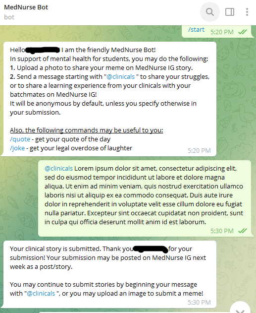
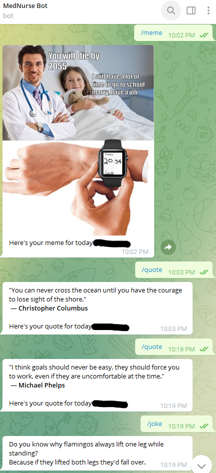
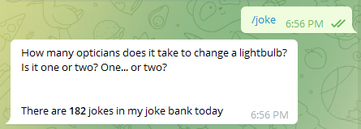
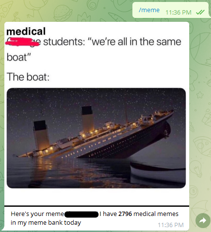
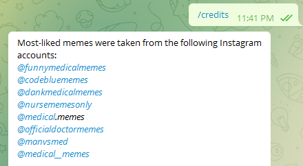
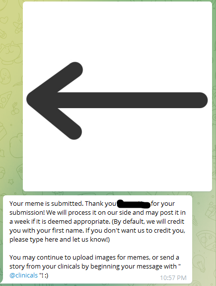

# yeozhenhao's inspirational Telegram Bot with DIY Google Sheets Database-cum-API 
## Features
- Two Google Sheets, 1st to run the main bot, the 2nd to run the Database-cum-API
  - 1st Sheet with the main bot will have 3 tabs:
    1. **Sheet 1** which logs all messages sent to the bot
    2. **MemeSubmission** which logs messages containing a photo (which is a submission of a meme)
    3. **clinicals** which logs messages starting with *@clinicals*, thus enabling convenient recording of users who submitted their personal clinical experiences to the bot.
  - 2nd Sheet (the DIY Database-cum-API) contains 5 tabs:
    1. **App** which is where the main bot will retrieve the Joke, Quote or Meme (memes are Google Drive ID links, will get to that later)
    2. **MemeFolder** which has 3 columns of data:
       - 1st column is the name of the image stored on Google Drive (not impt)
       - 2nd column is the Google Drive URL ID of the image *(VERY IMPT)*
       - 3rd column is just consecutive numbering (not impt)
    3. **MemeFolder2** same purpose as **MemeFolder**, but contains the images stored in a separate Google Drive folder. This is because for the running of this bot, it is only possible to store about 2000 photos in a single Google Drive folder (very technical reason, would rather not explain)
    4. **QuotesData** contains all the quotes:
       - 1st column is the quote *(VERY IMPT)*
       - 2nd column is the author's name *(VERY IMPT)*
       - 3rd column is just consecutive numbering (not impt)
       - - last column has a cell where it takes the highest number of the consecutive numbering column *(not impt)*
    5. **JokeData** contains all the jokes:
       - 1st column is the joke *(VERY IMPT)*
       - 2nd column is just consecutive numbering (not impt)
       - last column has a cell where it takes the highest number of the consecutive numbering column *(not impt)*
  
- Technically, the bot is stored 24/7 for free in a Google Sheet on Google Drive, using Webhook to retrieve any updates from the Telegram bot. Talk about free real estate!
  - To turn a Google Sheet into a smart Sheet that can run the main bot / run a Database-cum-API, you will need the magic of Google Apps Script (you may access it under the *Extensions* tab)

- 

#### About this project
Made a bot for NUS Medical Club (aka MedNurse Club) for Nursing &amp; Medical students to get jokes, quotes and submit their memes!

## All the required environment variables explained
The environment variables are marked with "<bla bla !>".\
*Note: from here on, the 2nd Google Sheet which will be the database-cum-API will be referred to as "QuotesAPI"*
###### var token = "<your bot's Telegram token!>";
Your bot's Telegram token from BotFather.
###### var url = "https://api.telegram.org/bot" + token;
No need to edit this.

###### var webAppUrl = "<URL of the deployed WebApp of any Google Sheets file. The Apps Script should contain the main code of the bot itself (i.e. CodeForMainBot.gs)!>";
- After you have deployed the WebApp of the Google Sheet Apps Script with code of the main bot itself (Apps Script of the 1st Google Sheet), they should show the URL under "Web app URL". Copy it, and replace the code above.
- e.g. https://script.google.com/macros/s/dasdasjk3213213kjwer/exec
###### var ssId = "<URL ID of the Google Sheets which contains the main code in the Apps Script. A Google Sheet was used so it can log all of the chats to the bot!>";
- URL ID of the 2nd Google Sheets. Should look like a long alphanumeric combination
###### var wimId = "<Your Telegram Chat ID, so the bot will text you an error message if it encounters an error during running of the bot!>";
- This is basically for debugging purposes should your bot encounter an error while running the bot. It does not always give you proper error codes, but at least it will send you a meaningless message every time it encounters an error, so that you know something is wrong.
###### var GDUploadFolderId = "<URL ID of the Google Drive link in which you want all of the photos which were sent to the bot to be uploaded; this enables automatic saving of meme submission to the bot into my Google Drive!>";
- URL ID of the Google Drive link where you want all of the images sent to the bot to be stored to. Should look like a long alphanumeric combination
- The original purpose of this was to enable students to send their own meme submissions so they could be published e.g. on Instagram
- TLDR: Any image sent to the bot will automatically be uploaded into the Google Drive directly. 
###### var QuotesAPI = "<URL of the deployed WebApp of the Google Sheets Quotes API which contains a database of all the inspirational quotes and jokes. The Google Sheets must already be deployed as a WebApp (see the other QUOTES-Code.gs to find out the code to turn a Google Sheets into a Quotes & Jokes API!>";
- After you have deployed the WebApp of the Google Sheet Apps Script with code of the QuotesAPI.gs (Apps Script of the 2nd Google Sheet), they should show the URL under "Web app URL". Copy it, and replace the code above. 
###### var GDMemesFolderId1 = "<URL ID of the 1st Google Drive folder where you want to upload a database of at most 2000 images (memes)!>"; '''Photo uploads of memes are split into 2 folders so that uploading can be done separately, enabling us to load >2000 memes into the Bot from Google Drive'''
self-explanatory
###### var GDMemesFolderId2 = "<URL ID of the 2nd Google Drive folder where you want to upload a database of at most 2000 images (memes)!>";
self-explanatory
###### var GSMemeFolderSheetId = "<URL ID of the Google Sheets Quotes API. One of the tabs in the Quotes API will be used to record the outputs of functions listFilesInFolderStep1 & listFilesInFolderStep2 in the setting up a meme database AFTER the 2000+ memes have been uploaded into any two Google Drive folders.!>"
- URL ID of the QuotesAPI Google Sheets (NOT the WebApp). The *MemeFolder* and *MemeFolder2* tabs in the QuotesAPI Google Sheet will be used to record the outputs of functions listFilesInFolderStep1 & listFilesInFolderStep2 in the setting up a meme database AFTER the 2000+ memes have been uploaded into any two Google Drive folders.!>"
- *Note: after the meme images have been uploaded & the environment variables have been keyed in, you may proceed to run the *listFilesInFolderStep1* & *listFilesInFolderStep2* functions which will output the essential Google Drive URL IDs of each and every meme photo (stored in 2 separate Google Drive folders as explained before) on into the *MemeFolder* and *MemeFolder2* tabs.

## How to make your own inspirational bot with the code in this GitHub repo
1. Create 2 separate Google Sheets, & create the required tabs with the exact same names as described above (no restriction on which folder the Sheets are stored! But they should preferably be under the same account due to permissions), failing which may throw an error as the main bot may not be able to find the Sheet with the Sheet name.
2. Copy & paste the code from *CodeForMainBot.gs* (open as a .txt file) and copy them into the defaultly-named "Code.gs" in one of the Google Sheets Apps Script.
   - Then, fill in the required environment variables located at the top of the code (bascially all the var before the first "function" code)
     - NOTE: URL IDs are NOT URLs. They are part of the URL (the weird code alphanumeric combination after a slash '/')

3. Copy & paste the code from *CodeForQuotesAPI.gs* (open as a .txt file) and copy them into the defaultly-named "Code.gs" in the 2nd Google Sheets Apps Script.
4. In the QuotesAPI Google Sheet (2nd Google Sheet), key in the jokes under *JokesData* tab, filling the *(VERY IMPT)* columns as described above. You may wish to code your own formula/Fill Down to fill in the *(not impt)* columns.
5. In the QuotesAPI Google Sheet (2nd Google Sheet), key in the quotes under *QuotesData* tab, filling the *(VERY IMPT)* columns as described above. You may wish to code your own formula/Fill Down to fill in the *(not impt)* columns.
6. In the QuotesAPI Google Sheet (2nd Google Sheet), fill in the *App* tab following the instruction in the reference links:
   - [Impt reference link 1](https://hooshmand.net/build-api-google-sheets/): Explains how to fill in the *App* tab
   - [Impt reference link 2](https://docs.google.com/spreadsheets/d/1C55j4UC2agNM4fvN2plIVsQrLaAV2Q0wYE2TE3KpJK0/edit?usp=sharing): *App* tab example
7. That's it! Your Telegram Bot should work.
   - You may want to edit the instruction texts of the Telegram bot in the main bot Code.gs; the instructions were meant for my school community.
   - Instead of verbally explaining the functionalities of my bot, I feel that picture paints a thousand words. So I will just include photos of my bot functions below with captions!
8. Please share this GitHub around if you enjoyed this tutorial! It is my pleasure to give back to the community after learning so much about coding from different articles on the Internet.

## Bot functions (in photos)

***Starting the bot & starting your message with @clinicals***
Starting any message with @clinicals will tell the bot to save the long text part into the 1st Google Sheets (main bot) under the **clinicals** tab

***Joke, Quote and Meme command***

***Joke command after update to show the total number of jokes available stored on Google Sheets database-cum-API***

***Meme command after update to show the total number of memes available stored on Google Drive***

***Giving credit where it's due: >2000 medical memes were taken from various meme Instagram accounts***

***When you send the bot any photo, it instantly gets uploaded to a specific folder on Google Drive***